  

  
  

## 👨‍💻 About me

My name is **Denis**. I'm a **C# / .NET software engineer** from Belarus, living in Pinsk.

- 🧱 Interested in **Clean Architecture**, backend design and real-world product development
- ⚙️ Main stack: **C#**, **.NET**, **ASP.NET Core**, **PostgreSQL**, **Git**
- 🎮 Also have experience with **Unity**

## 🧰 Tech Stack

  

  
  
  
  
  
  

## 📫 Contacts

  
  
  

## 📊 GitHub Stats

  
  

  

## 📈 Activity

  

